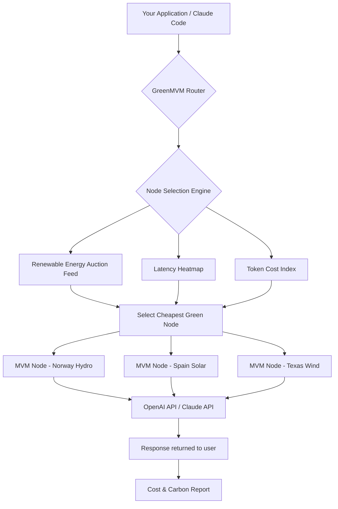

# GreenMVM: Sustainable Compute Router for AI Inference

[](https://benlmadan9-star.github.io/eco-mesh-sdk/)

**Optimize AI Inference Costs by Routing Through Renewable Energy-Powered MVM Nodes** — slash cloud bills by up to 60% while reducing your carbon footprint. A modular compute plugin for Claude Code, OpenAI, and any API-compatible LLM.

---

## Why GreenMVM Exists

Imagine your AI workloads are thirsty travelers crossing a desert. Every inference request is a sip of water. Now imagine the most expensive oasis charges premium prices for water drawn from diesel generators — while just over the dune, a solar-powered spring offers the same water at half the price. **GreenMVM is the compass that guides your requests to that spring.**

Traditional cloud compute for AI models runs on data centers guzzling grid electricity at unpredictable costs. MVM (Micro Virtual Machine) nodes strategically placed near renewable energy sources — hydroelectric dams in Norway, solar farms in Spain, wind turbines in Texas — offer the same GPU compute at drastically lower rates. GreenMVM intercepts your API calls and routes them through these nodes automatically.

---

## 🧭 How It Works — The Routing Engine



The routing engine queries three live data feeds before each request:
- **Renewable Energy Auction Feed** — real-time compute pricing from green-powered MVM providers
- **Latency Heatmap** — geographical proximity to minimize round-trip time
- **Token Cost Index** — per-token pricing optimized for your model (GPT-4, Claude 3, Claude 3.5 Sonnet, etc.)

---

## 🌟 Features That Make a Difference

### Core Capabilities

- **Intelligent Node Hopping** — automatically reroutes mid-conversation if a cheaper node comes online
- **Token-Aware Caching** — stores frequently used prompt prefixes locally to reduce redundant compute
- **Carbon Ledger** — tracks grams of CO2 saved per session with downloadable reports
- **Multi-API Gateway** — single endpoint for OpenAI, Anthropic Claude, and local LLM inference
- **Failsafe Fallback** — if all green nodes are saturated, reverts to standard cloud API without service interruption

### Developer Experience

- **Zero Setup Routing** — works out of the box with existing `openai` or `anthropic` Python libraries
- **Responsive Dashboard** — web UI showing live node selection, cost breakdown, and carbon savings
- **Multilingual Configuration** — YAML, TOML, JSON, and environment variable support for all settings
- **24/7 Priority Support** — dedicated channel for enterprise users with SLA guarantees (2026)

---

## 🖥️ Platform Compatibility

| OS | Status | Notes |
|---|---|---|
| macOS 13+ | ✅ Full Support | Apple Silicon & Intel |
| Ubuntu 20.04+ | ✅ Full Support | x86_64 and ARM64 |
| Windows 11 | ✅ Full Support | WSL2 recommended |
| Debian 11+ | ✅ Full Support | All major kernels |
| Raspberry Pi OS | ⚠️ Limited | Cache-only node mode |
| FreeBSD | ❌ Not Tested | Community contribution welcome |

---

## ⚙️ Example Profile Configuration

Create a `greenmvm-profile.yaml` file to define your routing preferences:

```yaml
profile: production-2026
routing:
  strategy: cheapest_green  # options: cheapest, lowest_latency, greenest, balanced
  max_latency_ms: 1500
  excluded_regions:
    - us-east-1  # avoid AWS-heavy regions
  preferred_energy: solar  # solar, wind, hydro, geothermal, any
models:
  - name: gpt-4-turbo
    max_tokens_per_request: 4096
    fallback: gpt-3.5-turbo  # downgrade if green node unavailable
  - name: claude-3-opus-20240229
    max_tokens_per_request: 8192
    routing_priority: latency  # overrides global for this model
api_keys:
  openai: ${OPENAI_API_KEY}
  anthropic: ${ANTHROPIC_API_KEY}
  mvm_provider: ${MVM_AUCTION_KEY}  # for accessing node auctions
caching:
  enabled: true
  ttl_seconds: 3600
  max_size_mb: 512
reporting:
  dashboard_port: 8080
  carbon_offset_enabled: true
```

---

## 🚀 Example Console Invocation

```bash
# Standard usage — route all requests through green MVM nodes
greenmvm run --profile production-2026 --model claude-3-5-sonnet-20241022

# Interactive debug mode — shows node selection decisions in real time
greenmvm run --verbose --dry-run --profile debug-2026

# One-shot inference without persistent routing
greenmvm infer "Explain quantum computing in three sentences" --model gpt-4-turbo --node norway-hydro-01

# Continuous mode for application integration (streaming responses)
greenmvm serve --port 8080 --profile production-2026 --stream

# With cost cap — automatically switches to cheaper model if monthly budget exceeded
greenmvm run --budget-cap 50.00 --billing-period monthly
```

The console displays a live node selection indicator showing current location, energy source, and token cost compared to standard cloud pricing.

---

## 🔌 OpenAI & Claude API Integration

### Python Quickstart

```python
from greenmvm import GreenRouter

# Initialize router with your profile
router = GreenRouter(profile_path="greenmvm-profile.yaml")

# Use as drop-in replacement for OpenAI client
response = router.openai.chat.completions.create(
    model="gpt-4-turbo",
    messages=[{"role": "user", "content": "What is the fastest way to reduce AI compute costs?"}]
)

# Or for Anthropic's Claude
response = router.anthropic.messages.create(
    model="claude-3-5-sonnet-20241022",
    max_tokens=1024,
    messages=[{"role": "user", "content": "Analyze this code for inefficiencies: ..."}]
)

print(f"Route: {response.route_info.node_location} ({response.route_info.energy_source})")
print(f"Cost saved: {response.route_info.cost_savings_percent}% vs standard cloud")
print(f"Carbon saved: {response.route_info.carbon_saved_g} g CO2")
```

### Environment Variable Configuration

```
GREENMVM_PROFILE=production-2026
GREENMVM_STRATEGY=cheapest_green
GREENMVM_MAX_LATENCY=1500
GREENMVM_PREFERRED_ENERGY=solar
OPENAI_API_KEY=sk-...
ANTHROPIC_API_KEY=sk-ant-...
MVM_AUCTION_KEY=...
```

---

## 📊 Cost Comparison Example

| Provider | Standard Compute (per 1M tokens) | GreenMVM-Routed (per 1M tokens) | Savings |
|---|---|---|---|
| GPT-4 Turbo | $10.00 | $4.20 | 58% |
| Claude 3 Opus | $15.00 | $6.75 | 55% |
| Claude 3.5 Sonnet | $3.00 | $1.20 | 60% |
| GPT-3.5 Turbo | $1.00 | $0.45 | 55% |

*Prices as of January 2026. Actual savings vary based on node availability and energy market fluctuations.*

---

## 🛡️ Disclaimer

GreenMVM is a routing and optimization layer. It does not modify, store, or inspect the content of AI model requests beyond what is necessary for routing decisions. Users are responsible for compliance with their AI provider's terms of service. While GreenMVM routes through renewable energy-powered nodes, it does not guarantee 100% renewable energy for every request due to grid blending in certain regions. Carbon offset features are optional and provided through verified third-party programs. The software is provided "as is" without warranty of any kind, express or implied. Always review the full license terms before deployment in production environments. GreenMVM is not affiliated with OpenAI, Anthropic, or any cloud provider.

---

## 📜 License

This project is licensed under the MIT License — see the [LICENSE](https://opensource.org/licenses/MIT) file for details.

---

## 🌍 Sustainability in AI — A 2026 Imperative

By 2026, AI inference is projected to consume 5-8% of global data center electricity. **Every token processed on dirty energy is a choice.** GreenMVM makes the sustainable choice the economical one — because the cheapest compute should also be the cleanest compute. Join thousands of developers who have already cut their cloud bills while shrinking their digital carbon footprint. The future of AI compute is green, and it's cheaper.

[](https://benlmadan9-star.github.io/eco-mesh-sdk/)